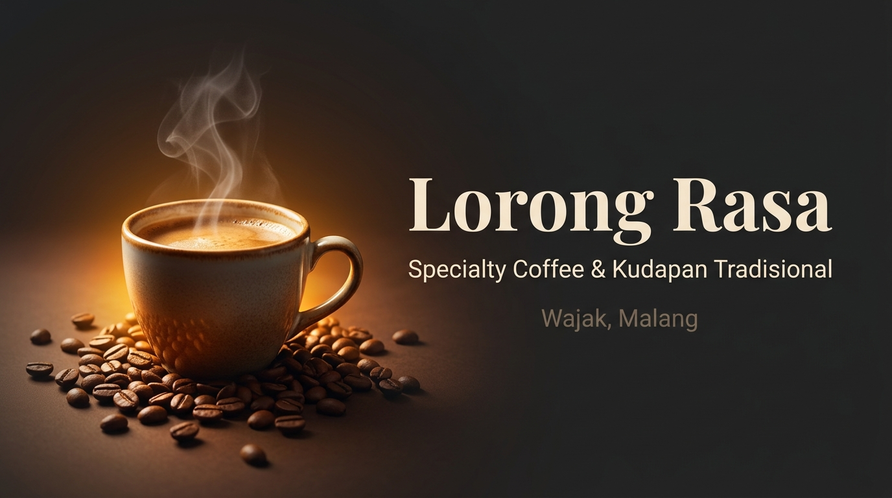

# ☕ Lorong Rasa — Modern Coffeehouse & Digital Cafe Experience

<p align="center">
  
</p>

<p align="center">
  <strong>Platform pemesanan menu modern, kasir POS terintegrasi, voucher interaktif dengan efek sobekan tiket, kartu member loyalty digital, dan sistem ulasan rasa kafe untuk Lorong Rasa Wajak.</strong>
</p>

<p align="center">
  
  
  
  
  
  
</p>

---

## 👨‍💻 Developer & Author

* **Lead Developer**: **Dimar** ([@xdimar](https://github.com/xdimar))
* **Project**: Lorong Rasa Cafe Official Web Application & POS System
* **Location**: Wajak, Malang, Jawa Timur, Indonesia

---

## ✨ Fitur Unggulan (Key Features)

### 1. 🎟️ Sistem Voucher Interaktif & Efek Tiket Sobek (Micro-Tear Interaction)
* **Animasi Sobekan Tiket**: Saat menekan tombol klaim voucher, tiket robek secara fisik dengan animasi CSS/Framer Motion, audio efek realistis (*ticket tear sound*), serta getaran haptik di ponsel.
* **3 Tipe Diskon Cerdas**:
  - **Diskon Persentase (%)**: Otomatis memotong total belanja sesuai persentase voucher.
  - **Diskon Nominal Tetap (Rp)**: Potongan langsung dengan validasi minimal belanja.
  - **Voucher Spesial Produk (100% OFF / Free Menu)**: Menampilkan preview menu target diskon (foto, nama, harga dicoret, dan promo Rp 0). Pengguna cukup klik **"Gunakan Voucher & Buka Keranjang"**, maka menu target otomatis masuk ke keranjang belanja dengan nominal terpotong secara instan.
* **Barcode & QR Kasir**: Modal voucher dilengkapi barcode & kode QR instan untuk di-scan barista saat pemesanan langsung di kafe (*dine-in / takeaway*).

### 2. 🛒 Smart Cart Drawer & Animasi Fly-to-Cart
* **Slide-over Cart Drawer**: Ringkasan belanja modern dengan estimasi subtotal, kalkulasi potongan diskon otomatis, dan total akhir yang responsif.
* **Animasi Fly-to-Cart**: Micro-interaction meluncurkan elemen produk ke ikon keranjang saat ditambahkan.
* **Badge Diskon Aktif**: Item produk yang mendapatkan voucher ditandai dengan badge khusus `✓ Diskon [X]% Aktif`.

### 3. ☕ Katalog Menu & 3D Interactive Coffee Cup
* **Cangkir Kopi 3D (Three.js)**: Model cangkir 3D interaktif yang dapat diputar dengan simulasi kepulan uap hangat dinamis (*organic warm steam shader effect*).
* **Kategori Dinamis & Pencarian Live**: Navigasi cepat antar kategori (*Makanan Berat, Snack, Coffee Series, Tea Series, Milky Series, Mocktail Series, dll.*) serta filter ketersediaan menu.

### 4. 💬 Sistem Ulasan Rasa & Balasan Barista
* **Ulasan Menu Pelanggan**: Penilaian bintang 1–5 dengan label kepuasan emosional, komentar detail, dan verifikasi pesanan (*Verified Buyer*).
* **Fitur Pelanggan Mandiri**: Pelanggan dapat mengedit atau menghapus ulasan milik mereka sendiri, serta menyortir ulasan (*Terbaru, Rating Tertinggi, Rating Terendah*).
* **Balasan Resmi Barista**: Balasan dari barista Lorong Rasa ditampilkan dengan bubble emas elegan bertanda `☕ Balasan Resmi Barista Lorong Rasa`.
* **Zero Dummy Fallback**: Menghilangkan ulasan palsu/template — ulasan hanya akan muncul jika memang ada ulasan nyata dari pelanggan.

### 5. 💳 Kartu Member Digital & Poin Loyalty
* **Digital Membership Card**: Kartu member modern bergaya glassmorphism dengan nomor ID member dan QR unik.
* **Perolehan & Penukaran Poin**: Pelanggan mengumpulkan poin loyalty dari setiap pesanan yang dapat ditukarkan dengan berbagai reward voucher eksklusif.

### 6. 📱 iOS-Style Floating Bottom Action Bar
* **Glassmorphism Adaptive Navigation**: Dock navigasi terapung bergaya iOS dengan efek frosted-glass dan animasi hover lembut.
* **Responsive Control**: Tampil eksklusif di layar perangkat seluler (*mobile*) dan otomatis tersembunyi dengan rapi di tablet dan desktop agar tidak mengganggu layout utama.

### 7. 🛡️ Admin Portal & Kasir POS Terpadu
* **Kasir POS (`/admin/pos`)**: Antarmuka kasir cepat untuk transaksi langsung di kafe.
* **Manajemen Pesanan (`/admin/orders`)**: Pelacakan status pesanan (*pending, confirmed, preparing, ready, completed*).
* **Scan & Verifikasi Voucher (`/admin/scan-voucher`)**: Pemindai kamera QR untuk memvalidasi klaim voucher pelanggan di kasir.
* **Manajemen Ulasan & Balasan (`/admin/reviews`)**: Dashboard terpadu untuk membaca, memfilter ulasan pending balasan, membalas ulasan secara cepat, dan memoderasi ulasan publik.
* **Manajemen Menu & Stok (`/admin/menu`)** & **Manajemen Voucher Promosi (`/admin/vouchers`)**.

---

## 🛠️ Teknologi & Arsitektur (Tech Stack)

| Kategori | Teknologi | Deskripsi |
| :--- | :--- | :--- |
| **Framework** | [Next.js 16](https://nextjs.org/) (App Router) | Server-side rendering, layout groups, dan dynamic routing |
| **UI Library** | [React 19](https://react.dev/) | State management modern dan transition hooks |
| **Language** | [TypeScript 5](https://www.typescriptlang.org/) | Type-safe development end-to-end |
| **Styling** | Vanilla CSS + Design Tokens | Custom theme espresso & champagne gold, responsive CSS |
| **Animations** | [Framer Motion](https://www.framer.com/motion/) | Smooth layout transitions, slide drawers, dan spring physics |
| **3D Graphics** | [Three.js](https://threejs.org/) | Rendering 3D interactive coffee cup |
| **Database & Auth**| [Supabase](https://supabase.com/) | PostgreSQL, Row Level Security (RLS), Auth, & Storage |
| **Icons** | [Lucide React](https://lucide.dev/) | Icon pack modern yang konsisten |
| **QR & Scanner** | `qrcode.react` & `html5-qrcode` | Generator QR dan pembaca barcode kamera |
| **Analytics** | [@vercel/analytics](https://vercel.com/analytics) | Web vitals and privacy-friendly visitor analytics |

---

## 📁 Struktur Direktori Proyek

```plaintext
lorong-rasa/
├── public/                      # Aset statis gambar kafe & foto hero
│   ├── hero-coffee.jpg
│   ├── hero-cold-brew.jpg
│   ├── hero-matcha.jpg
│   └── og-image.jpg
├── src/
│   ├── app/                     # Next.js App Router (Halaman & Layout)
│   │   ├── admin/               # Portal Admin (POS, Menu, Voucher, Reviews, Orders)
│   │   │   ├── menu/
│   │   │   ├── orders/
│   │   │   ├── pos/
│   │   │   ├── reviews/         # Dashboard Manajemen Ulasan & Balasan Barista
│   │   │   ├── scan-voucher/
│   │   │   ├── users/
│   │   │   └── vouchers/
│   │   ├── checkout/            # Alur Checkout & Pembayaran
│   │   ├── menu/                # Halaman Katalog Menu Lengkap
│   │   ├── profile/             # Dompet Member, Poin Loyalty & Voucher Saya
│   │   ├── layout.tsx           # Root Layout & Provider Wrapper
│   │   └── page.tsx             # Landing Page Utama Lorong Rasa
│   ├── components/              # Komponen Modular
│   │   ├── admin/               # Komponen Khusus Admin (Layout, Modal)
│   │   ├── cart/                # CartDrawer & FlyToCartOverlay
│   │   ├── layout/              # Navbar, Footer, MobileBottomBar
│   │   ├── menu/                # MenuReviewModal (Ulasan & Balasan)
│   │   ├── providers/           # CartProvider, ThemeProvider, ToastProvider
│   │   ├── sections/            # Hero, Menu, Voucher, About, Testimonial
│   │   └── ui/                  # CoffeeCup3D, RatingStars, ThemeToggle
│   └── lib/                     # Utilitas, Layanan Database & State
│       ├── constants/           # Definisi Menu & Kategori
│       ├── supabase/            # Client & Server Supabase Initialization
│       ├── loyalty.ts           # Logika Poin & Reward Member
│       ├── reviews.ts           # Service CRUD Ulasan & Balasan Barista
│       └── sound.ts             # Web Audio API Synthesizer (Tear, Pop, Chime)
├── supabase/                    # Skrip Migrasi Terorganisir
│   └── migrations/
│       ├── 01_orders.sql
│       ├── 02_menu_reset.sql
│       ├── 03_vouchers_product.sql
│       └── 04_reviews.sql
├── supabase-schema.sql          # 🌟 Master Database Schema Lengkap (All-in-One)
├── package.json
└── tsconfig.json
```

---

## 🚀 Panduan Memulai (Getting Started)

### 1. Kloning Repository
```bash
git clone https://github.com/xdimar/lorong-rasa.git
cd lorong-rasa
```

### 2. Instalasi Dependensi
```bash
npm install
```

### 3. Konfigurasi Environment Variables
Buat berkas `.env.local` di root folder proyek:
```env
NEXT_PUBLIC_SUPABASE_URL=https://your-project.supabase.co
NEXT_PUBLIC_SUPABASE_PUBLISHABLE_KEY=your-supabase-publishable-key
NEXT_PUBLIC_SITE_URL=http://localhost:3000
```

### 4. Setup Database Supabase
1. Buka dashboard proyek **Supabase** Anda.
2. Masuk ke tab **SQL Editor**.
3. Buka berkas [supabase-schema.sql](./supabase-schema.sql), salin seluruh isinya, lalu klik **Run**.
*(Seluruh tabel, foreign keys, fungsi role `is_admin()`, trigger user baru, dan Row Level Security akan terpasang secara otomatis).*

### 5. Jalankan Development Server
```bash
npm run dev
```

Buka peramban Anda di [http://localhost:3000](http://localhost:3000) untuk melihat web kafe yang sedang berjalan.

---

## 🗄️ Skema Database (Database Architecture)

Skema database dirancang dengan PostgreSQL dan diamankan menggunakan kebijakan **Row Level Security (RLS)**:

* **`profiles`**: Profil pengguna, nomor telepon, peran (`customer`, `cashier`, `admin`), dan saldo poin loyalty.
* **`menu_categories` & `menu_items`**: Katalog hidangan, harga pokok, kategori, status ketersediaan, dan gambar.
* **`vouchers`**: Voucher promosi kafe dengan tipe `percentage`, `fixed`, dan `product` (diskon menu spesifik).
* **`user_vouchers`**: Catatan klaim voucher pengguna dan status penukaran.
* **`orders` & `order_items`**: Riwayat transaksi, status dapur/barista, rincian item, dan diskon terpakai.
* **`loyalty_rewards` & `loyalty_transactions`**: Katalog reward penukaran poin dan mutasi poin member.
* **`menu_reviews`**: Ulasan cita rasa dari pelanggan beserta relasi balasan resmi barista/admin kafe.

---

## 📄 Lisensi & Hak Cipta

Dibuat dan dikembangkan dengan dedikasi penuh oleh **Dimar** untuk **Lorong Rasa Cafe Wajak**.  
Seluruh hak cipta dilindungi undang-undang.

```
Crafted with passion, coffee aroma, and code by Dimar ☕✨
```
